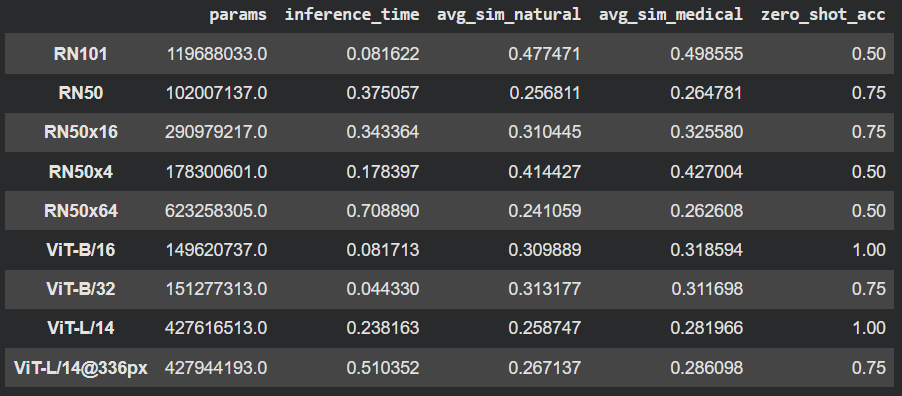
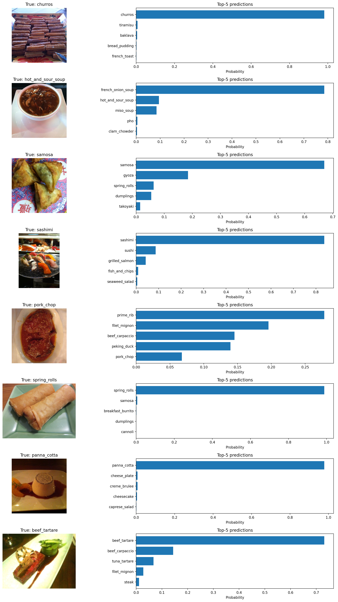

## Evaluation quantitative et confrontation des différents modèles de CLIP

## Résultats de CLIP dans le domaine médical sur d’autres exemples du jeu de données

## Performances de CLIP sur une tâche de classification d’images naturelles sur un autre jeu de données que CIFAR100

